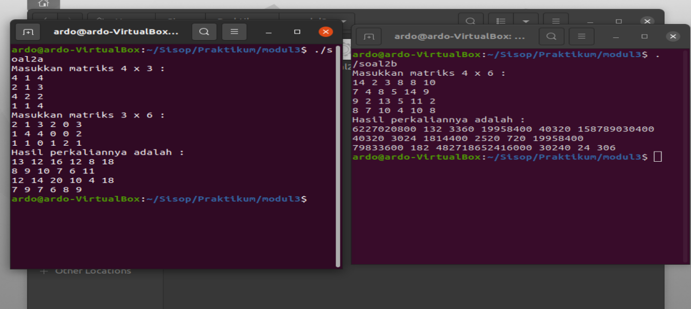
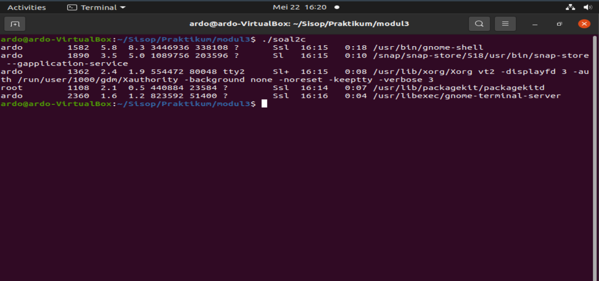
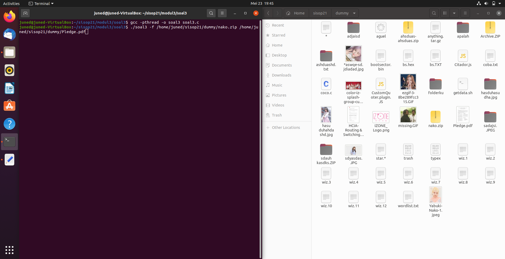
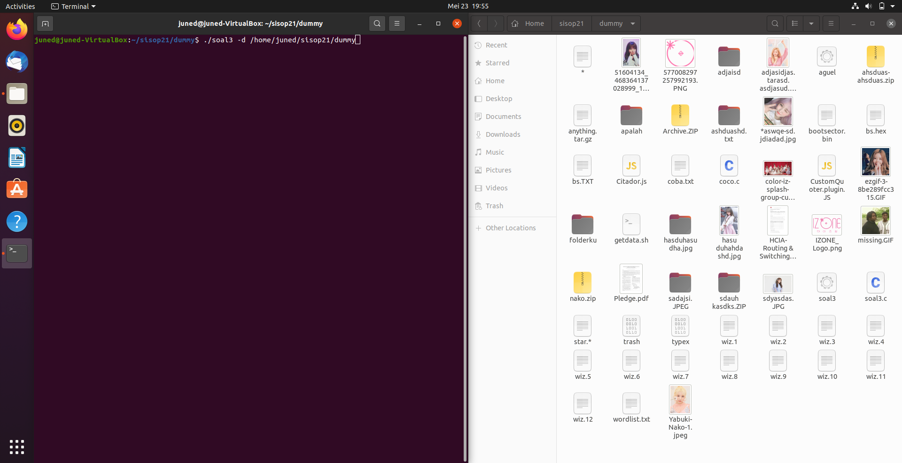
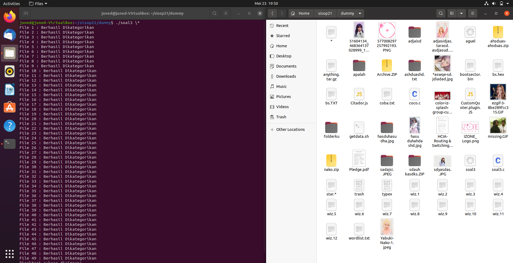
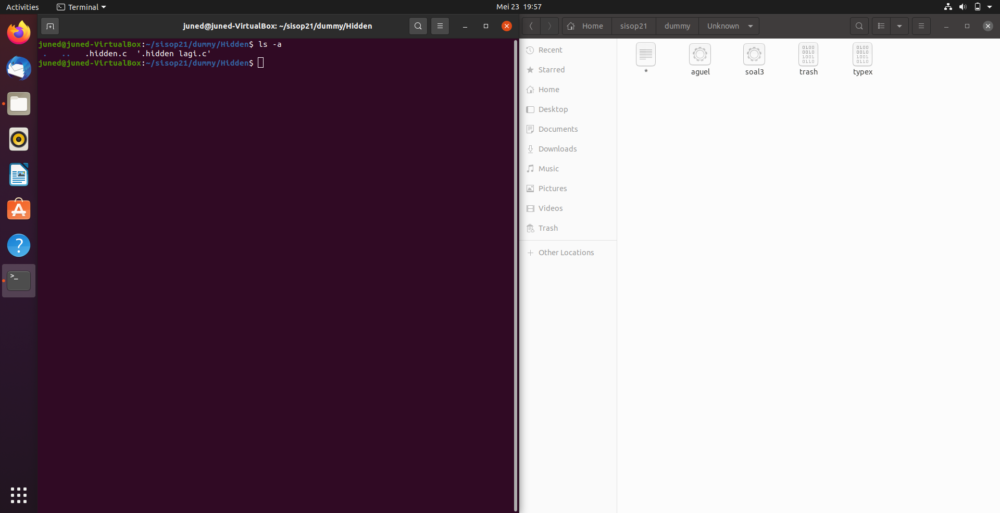

# soal-shift-sisop-modul-3-F05-2021

## Soal 1

### Kendala
Dikarenakan beberapa mata kuliah mengadakan dan memberikan ETS dan juga beberapa tugas atau quiz, jadi untuk soal nomer 1 bagian C sampai dengan H 
belum bisa dikerjakan dengan maksimal.

## Soal 2
Untuk soal nomor dua, terdapat 3 sub soal yang harus dikerjakan, dimana setiap sub soal memiliki perintahnya masing - masing.<br>

### Soal 2A
Di soal nomor 2A, kami diminta untuk "membuat program perkalian matriks 4x3 dengan 3x6 dan menampilkan hasilnya". Terdapat ketentuan
dimana kedua matriks yang akan digunakan merupakan input dari user dan nilai masing masing elemen harus di range 1 - 20.<br><br>
Untuk menyelesaikannya, dibuat source code "soal2a.c", yang didalamnya terdapat beberapa fungsi, seperti :
```
void isiMatriks1(){
    int i, j;
    printf("Masukkan matriks 4 x 3 : \n");
    for(i = 0; i < 4; i++){
        for(j = 0; j < 3; j++){
            scanf("%d", &a[i][j]);
        }
    }
}
```
Digunakan untuk mengisi matriks pertama, ukuran 4 x 3;<br>
Untuk mengisi matriks 3 x 6, digunakan fungsi ***isiMatriks2***, yang serupa dengan fungsi diatas. Hanya saja,
pada fungsi ***isiMatriks2*** batas for loop yang digunakan adalah i < 3, dan j < 6 (menyesuaikan ukuran matriks 2)<br><br>

```
void kali(){
    int i, j, k;
    for(i = 0; i < 4; i++){
        for(j = 0; j < 6; j++){
            ans[i][j] = 0;
            for(k = 0; k < 3; k++){
                ans[i][j] += a[i][k] * b[k][j];
            }
        }
    }
}
```
Digunakan untuk mengalikan matriks yang telah dimasukkan. Digunakan batas perulangan 4 dan 6 karena menyesuaikan dengan ukuran matriks yang akan terbentuk
akibat mengalikan kedua matriks sebelumnya yang telah dimasukkan ([4 x 3] x [3 x 6] = [4 x 6]).<br>
Tahapan pengaliannya adalah :
- `ans[i][j] = 0;`, pertama diset menjadi 0 terlebih dahulu untuk inisiasi nilai matriks hasil perkalian.
- `ans[i][j] += a[i][k] * b[k][j];`, untuk setiap elemen ans[i][j] merupakan hasil penjumlahan dari perkalian antara seluruh element di baris i matriks pertama
dengan seluruh element di kolom j matriks kedua.
<br><br>

Pada program mainnya, berisikan :
```
int main(){

    isiMatriks1();

    isiMatriks2();

	...

    kali();
    printHasil();

	...
}   
```
Pertama dijalankan fungsi untuk mengambil matriks input dari user, dilakukan proses perkalian, dan ditampilkan hasilnya.

### Soal2B
Di soal nomor 2B, kami diminta untuk memodifikasi program 2A agar menggunakan shared memory untuk menyimpan hasil perkalian matriksnya. 
Asumsikan matriks hasil perkalian tersebut sebagai *A*. Kemudian kami diminta untuk membuat agar program 2B dapat menerima input matriks lagi
dari user, asumsikan sebagai matriks *B*. Kemudian lakukan perhitungan dimana setiap elemen dari matriks A menjadi angka untuk faktorial, dan setiap
elemen dari matriks B menjadi batas maksimal faktorialnya. **Syaratnya adalah untuk setiap perhitungan pada cell, wajib menggunakan thread**. Ketentuan yang diberikan adalah :
- If a >= b  -> a!/(a-b)!
- If b > a -> a!
- If 0 -> 0
<br><br>

Pertama - tama kita modifikasi terlebih dahulu program 2A :
```
int main(){
	
	...

    // Bantuan 2B shared memory
    //Key yang bakal digunain buat shared memory
    key_t key = 1234;

    //Buat segment shared memorynya (return identifiernya)
    int shmid = shmget(key, sizeof(int [4][6]), IPC_CREAT | 0666);
    ans = shmat(shmid, NULL, 0);

	....
	
    sleep(30):

    shmdt(ans);
    shmctl(shmid, IPC_RMID, NULL);
}   
```
Pada program main-nya, ditambahkan inisiasi shared memory segment untuk matriks ans, agar apapun yang diisikan ke dalam matriks ans nantinya
dapat digunakan bersama - sama untuk proses lainnya (matriks ans pada program 2A digunakan untuk menyimpan hasil perkalian).
Setelah 30 detik berjalan, maka shared memory ans akan di detach dari segment shared memory dan kemudian di hancurkan segment shared memorynya.
<br><br>

Setelah berhasil mendapat hasil perkalian program 2A lewat shared memory, maka program 2B dapat dijalankan. Dalam program 2B terdapat :
```
struct arg_struct{
    int baris;
    int kolom;
};
```
Struct diatas digunakan sebagai bantuan untuk mengoper parameter dari fungsi yang akan digunakan oleh thread.
<br><br>

Untuk assist function menghitung factorial dari tiap element A adalah :
```
void *factorialCustom(void *argumen){
    int i = ((struct arg_struct *)argumen)->baris;
    int j = ((struct arg_struct *)argumen)->kolom;
    result[i][j] = factCus(i, j);  
}
```
Fungsi diatas digunakan untuk memecah elemen parameter struct yang dikirimkan sebelumnya, agar bisa dihitung di function factCust; 
```
int factCus(int i, int j){
    unsigned long long hasil = 1, hasilPembagi = 1;
    int k;

    //Kasus 0
    if(aTemp[i][j] == 0 || b[i][j] == 0){
        return 0;
    }

    //a!
    for(k = aTemp[i][j]; k >= 1; k--){
        hasil *= k;
    } 

    // Kasus a!/(a-b)!
    if(aTemp[i][j] >= b[i][j]){
        for(k = aTemp[i][j] - b[i][j]; k >= 1; k--){
            hasilPembagi *= k;
        }
        return (hasil / hasilPembagi);
    }

    //kasus a!
    else if(aTemp[i][j] < b[i][j]){
        return hasil;
    }
}
```
Fungsi diatas adalah fungsi perhitungan factorial sesuai dengan ketentuan yang telah diberikan. Penjelasannya adalah :
- Kalau kasusnya di antara dua nilai yang diambil ada 0, maka hasilnya = 0;
- Kalau bukan 0, maka hitung terlebih dahulu nilai a! (karena dua kondisi lainnya memerlukan nilai a!).
- Kalau nilai element matriks A >= element matriks B, maka nilainya = (a!/(a-b)!);
- Kalau element matriks A < element matriks B, maka nilainya a!;
<br><br>

Dan yang terakhir pada main program terdapat :
```
int main(){
    key_t key = 1234;

    //Buat segment shared memorynya (return identifiernya)
    int shmid = shmget(key, sizeof(int[4][6]), IPC_CREAT | 0666);
    a = shmat(shmid, 0, 0);

    memcpy(aTemp, a, sizeof aTemp);

    shmdt(a);
    shmctl(shmid, IPC_RMID, NULL);

    isiMatriks1(b);

    pthread_t tid[4][6];

    int i, j;
    for(i = 0; i < 4; i++){
        for(j = 0; j < 6; j++){
            struct arg_struct *argumen = (struct arg_struct *)malloc(sizeof(struct arg_struct));
            argumen->baris = i;
            argumen->kolom = j;
            pthread_create(&tid[i][j], NULL, &factorialCustom, (void *)argumen);
        }
    }

    for(i = 0; i < 4; i++){
        for(j = 0; j < 6; j++){
            pthread_join(tid[i][j], NULL);
        }
    }

    printHasil();
}
```
Penjelasannya :
- ` key_t key = 1234;`, digunakan key yang sama dengan sebelumnya agar proses bisa saling mengakses resource shared memory
yang telah ditetapkan sebelumnya.
- `memcpy(aTemp, a, sizeof aTemp);`, setelah didapatkan matriks hasil perkalian dari proses sebelumnya. Dilakukan pengkopian dari matriks tersebut
ke matriks lokal agar lebih mudah untuk dioperasikan.
- `pthread_t tid[4][6];`, diinisiasikan thread yang akan digunakan sebanyak jumlah elemen yang akan dicari faktorialnya.
- Untuk setiap elemen matriks yang akan dicari faktorialnya, dibuatkan thread yang akan menjalankan fungsi *factorialCustom* melalui
` pthread_create(&tid[i][j], NULL, &factorialCustom, (void *)argumen);`.
- Kemudian, untuk memastikan semua thread yang dibuat telah selesai dijalankan dan proses utama tidak berlanjut mengerjakan hal yang lainnya,
maka dilakukan join thread, `pthread_join(tid[i][j], NULL);`.
- Kemudian yang terakhir print hasilnya `printHasil();`.

Ketika program 2a (kiri) dan 2b (kanan) dijalankan, jika dimasukkan matrix sesuai dengan test case yang diberikan, maka akan terlihat hasilnya adalah :<br>



### Soal2C
Pada soal 2C, kami diminta untuk membuat rangkaian IPC Pipes untuk menjalankan perintah "ps aux | sort -nrk 3,3 | head -5". Untuk menyelesaikannya, 
dimasukkan perintah :
```
int main(){
    int fd1[2], fd2[2];
    int status;
    pid_t pid;

    if(pipe(fd1) == -1){
        fprintf(stderr, "Pipe Failed" ); 
		return 1;
    }

    pid = fork();

    if(pid < 0){
        fprintf(stderr, "fork Failed" ); 
		return 1; 
    }

    else if (pid == 0){
        close(fd1[0]);
        dup2(fd1[1], 1);
        char *argv[] = {"ps", "aux", NULL};
        execv("/usr/bin/ps", argv);
    }

    while(wait(&status) > 0);
    close(fd1[1]);
    dup2(fd1[0], 0);

    if(pipe(fd2) == -1){
        fprintf(stderr, "Pipe Failed" ); 
		return 1;
    }

    pid = fork();

    if(pid < 0){
        fprintf(stderr, "fork Failed" ); 
		return 1; 
    }

    else if(pid == 0){
        close(fd2[0]);
        dup2(fd2[1], 1);
        char *argv[] = {"sort", "-nrk", "3,3", NULL};
        execv("/usr/bin/sort", argv);
    }

    while(wait(&status) > 0);
    close(fd2[1]);
    dup2(fd2[0], 0);

    char *argv[] = {"head", "-5", NULL};
    execv("/usr/bin/head", argv);

    close(fd2[0]);
    close(fd1[0]);
}
```
Akan ada 3 proses yang dijalankan, dan juga terlihat pada syntax akan ada 2 pipe yang akan kita gunakan. Jadi :
- `if(pipe(fd1) == -1){`, inisiasikan pipe pertama yang akan kita gunakan terlebih dahulu.
- Lalu kita lakukan spawning `pid = fork();`, sebuah child proses yang akan menjalankan perintah ps aux.
- Di dalam child proses tersebut, kita tidak memerlukan read-end pipe tersebut, sehingga dijalankan perintah `close(fd1[0]);`. Karena kita ingin menuliskan
perintah kedalam pipe tersebut, maka kita perlu membuka write-endnya dengan menggunakan perintah `dup2(fd1[1], 1);`, lalu masukkan perintah ps aux lewat execv.
- Kembali kedalam proses utama, didalam pipe ke 1 terdapat perintah ps aux tersebut. Selanjutnya, pipe ini perlu membaca perintah "sort" yang akan dimasukkan, oleh
karena itu, write end pipe 1 ini bisa ditutup melalui `close(fd1[1]);`, dan dibuka read-end nya `dup2(fd1[0], 0);`.
- Perhatikan, perintah sort nantinya juga harus bisa membaca perintah head yang akan dimasukkan. Maka sort harus dimasukkan kedalam sebuah pipe lagi. Oleh karena itu dijalankan 
perintah `if(pipe(fd2) == -1){`.
- Lakukan fork untuk sortnya.
- Sama seperti pada child proses sebelumnya, pada pipe ke 2 ini tutup read-endnya `close(fd2[0]);` terlebih dahulu karena tidak digunakan didalam proses, dan buka write-endnya melalui
`dup2(fd2[1], 1);` karena akan digunakan untuk menuliskan perintah ke dalam pipe.
- Kembali ke dalam proses utama, pipe ke dua akan membaca perintah "head", sehingga tutup write-endnya `close(fd2[1]);` dan buka read-endnya `dup2(fd2[0], 0);` agar 
proses selanjutnya (head) juga dapat terbaca oleh pipe ke dua.
<br><br>

Sehingga hasil akhirnya terbentuk perintah "ps" di pipe ke 1, yang membaca perintah "sort" di pipe ke 2, dimana pipe ke dua juga membaca perintah terakhir yaitu "head". Sehingga proses dapat berjalan
sesuai dengan syntax yang diberikan dengan menggunakan IPC pipes.

Ketika program 2c dijalankan, maka akan dihasilkan :<br>


### Kendala
- Awalnya bingung untuk menentukan ujung mana yang harus dibuka dan harus ditutup pada pipe untuk soal2c. Namun pada akhirnya bisa diselesaikan.
- Pada testcase yang diberikan, soal2b menghasilkan nilai minus, dan ternyata terjadi kesalahan pada tipe data yang digunakan.

## Soal 3
Rekap:
Program ini akan memindahkan file sesuai ekstensinya ke dalam folder sesuai ekstensinya yang folder hasilnya terdapat di working directory ketika program kategori tersebut dijalankan.

Contoh apabila program dijalankan:
```
# Program soal3 terletak di /home/izone/soal3
$ ./soal3 -f path/to/file1.jpg path/to/file2.c path/to/file3.zip
#Hasilnya adalah sebagai berikut
/home/izone
|-jpg
|--file1.jpg
|-c
|--file2.c
|-zip
|--file3.zip
```
### soal 3a
Program menerima opsi -f seperti contoh di atas, jadi pengguna bisa menambahkan argumen file yang bisa dikategorikan sebanyak yang diinginkan oleh pengguna. 
Output yang dikeluarkan adalah seperti ini :
```
File 1 : Berhasil Dikategorikan (jika berhasil)
File 2 : Sad, gagal :( (jika gagal)
File 3 : Berhasil Dikategorikan
```
Perlu dilakukan inisialisasi untuk tiap kasus `-f , -d dan \*` dengan cara berikut :
```

    if (strcmp(argv[1], "-f") == 0)
    {
 
        while (argv[i] != NULL)
        {
            err = pthread_create(&(threads[i - 2]), NULL, &moveFile, (void *)argv[i]);
            if (err != 0)
                printf("File %d: Sad, gagal :(\n", i - 1);
            else
                printf("File %d : Berhasil Dikategorikan\n", i - 1);
            i++;
        }

        for (p = 0; p < (i - 1); p++)
            pthread_join(threads[p], NULL);

        return 0;
    }
    else if (strcmp(argv[1], "-d") == 0)
    {
        listFilesRecursively(argv[2]);
        if (checkerror == 0)
        {
            printf("Direktori sukses disimpan!");
        }
        else
        {
            printf("Yah, gagal disimpan:(");
        }
    }
    else if (strcmp(argv[1], "*") == 0)
    {
        listFilesRecursively(".");
        if (checkerror == 0)
        {
            printf("Direktori sukses disimpan!\n");
        }
        else
        {
            printf("Yah, gagal disimpan:(");
        }
    }
```

Selanjutnya untuk mendapatkan extension dari file dapat menggunakan cara berikut
```
char *get_file_extension(char str[])
{
    char *pch = cleanFolderFromPath(str);
    // get first occurence of .
    char *result = strchr(pch, '.');
    if (result == NULL)
    {
        return NULL;
    }
    else
    {
        // remove the . (.txt => txt)
        return (result + 1);
    }
}
```
Selanjutnya dibuat fungsi untuk mejalankan pemindahan file-file
```
void *moveFile(void *arg)
{
    char *fileName = (char *)arg;
    char fileAsli[1000], fileCopy[1000];
    strcpy(fileAsli, fileName);
    strcpy(fileCopy, fileName);

    char *ext = get_file_extension(fileName);
    char *cleanName = cleanFolderFromPath(fileCopy);

    char folderName[120];

    if (cleanName[0] == '.')
    {
        sprintf(folderName, "Hidden");
    }
    else if (ext == NULL)
    {
        sprintf(folderName, "Unknown");
    }
    else
    {
        for (int i = 0; ext[i]; i++)
        {
            ext[i] = tolower(ext[i]);
        }
        sprintf(folderName, "%s", ext);
    }
    mkdir(folderName, 0777);
    char destDir[200];
    sprintf(destDir, "%s/%s/%s", curDir, folderName,
            cleanFolderFromPath(fileAsli));

    moveFileToNewPath(fileAsli, destDir);
    return NULL;
}
```

lalu menjadi

<br>


### Soal 3b
Soal ini diminta untuk membuat Program yang juga dapat menerima opsi -d untuk melakukan pengkategorian pada suatu directory. Namun pada opsi -d ini, user hanya bisa memasukkan input 1 directory saja, tidak seperti file yang bebas menginput file sebanyak mungkin. Contohnya adalah seperti ini:
```
$ ./soal3 -d /path/to/directory/
```
Perintah di atas akan mengkategorikan file di /path/to/directory, lalu hasilnya akan disimpan di working directory dimana program C tersebut berjalan (hasil kategori filenya bukan di /path/to/directory).
Output yang dikeluarkan adalah seperti ini :
```
Jika berhasil, print “Direktori sukses disimpan!”
Jika gagal, print “Yah, gagal disimpan :(“
```
berikut adalah case untuk -d, untuk menentukannya dapat menggunakan
```
    else if (strcmp(argv[1], "-d") == 0)
    {
        listFilesRecursively(argv[2]);
        if (checkerror == 0)
        {
            printf("Direktori sukses disimpan!");
        }
        else
        {
            printf("Yah, gagal disimpan:(");
        }
    }
```
Karena diminta untuk melakukan pengecekan secara rekursif, maka perlu dibuat fungsi baru yang dapat melakukannya yaitu ` listFilesRecursively(argv[2]);
```
void listFilesRecursively(char *basePath)
{
    char path[1000], srcPathForThread[1000];
    struct dirent **namelist;
    int n;
    int i = 0;
    n = scandir(basePath, &namelist, NULL, alphasort);
    if (n < 0)
        return;
    else
    {
        while (i < n)
        {
            if (strcmp(namelist[i]->d_name, ".") != 0 && strcmp(namelist[i]->d_name, "..") != 0)
            {
                strcpy(path, basePath);
                strcat(path, "/");
                strcat(path, namelist[i]->d_name);

                strcat(srcPathForThread, "/");
                strcat(srcPathForThread, namelist[i]->d_name);

                if (namelist[i]->d_type != DT_DIR)
                {
                    int err;
                    err = pthread_create(&(threads[threadCount - 2]), NULL, &moveFile,
                                         (void *)path);

                    if (err != 0)
                    {
                        checkerror++;
                        printf("File %d: Sad, gagal :(\n", threadCount - 1);
                    }
                    else
                        printf("File %d : Berhasil Dikategorikan\n", threadCount - 1);
                    threadCount++;

                    for (int p = 0; p < (threadCount - 1); p++)
                        pthread_join(threads[p], NULL);
                }

                listFilesRecursively(path);
            }
            free(namelist[i]);
            ++i;
        }
        free(namelist);
    }
}

```
Di dalam fungsi tersebut juga sudah terdapat thread yang akan melakukan pemindahan file
` err = pthread_create(&(threads[threadCount - 2]), NULL, &moveFile, (void *)path);`
Selanjutnya pada fungsi **moveFile** akan melakukan hal yang sama seperti `soal 3a` namun mengeluarkan output yang berbeda

menjadi


### soal 3c
Pada soal ini diminta untuk membuat program ini menerima opsi *, contohnya ada di bawah ini:
$ ./soal3 \*
Opsi ini akan mengkategorikan seluruh file yang ada di working directory ketika menjalankan program C tersebut.
hal yang dilakukan mirip seperti pada **soal 3b** yaitu dengan membuat case baru
```
 else if (strcmp(argv[1], "*") == 0)
    {
        listFilesRecursively(".");
        if (checkerror == 0)
        {
            printf("Direktori sukses disimpan!\n");
        }
        else
        {
            printf("Yah, gagal disimpan:(");
        }
    }
```
lalu menggunakan fungsi yang sama yaitu `listFilesRecursively(".");`

menjadi

### Soal 3d
Pada soal ini diminta untuk Semua file harus berada di dalam folder, jika terdapat file yang tidak memiliki ekstensi, file disimpan dalam folder “Unknown”. Jika file hidden, masuk folder “Hidden”.
<br>
untuk file yang tidak dapat dikategorikan sudah dilakukan pemeriksaan pada fungsi `moveFile` dan `catFolder`
dengan  cara 
```
  if (!strlen(extension_temp))
        {
            if (!isDirectory("Unknown"))
                mkdir("Unknown", 0777);
            strcpy(new_path, "Unknown/");
            strcat(new_path, filename);
            flag = 1;
        }
```
untuk file yang tersembuyi sudah dilakukan pemeriksaan pada fungsi `moveFile` dan `catFolder` dengan mengenali nama awal dari file tersebut adalah `.`
dengan  cara 
```
 if (filename[0] == '.')
    {
        if (!isDirectory("Hidden"))
            mkdir("Hidden", 0777);
        strcpy(new_path, "Hidden/");
        strcat(new_path, filename);
        moveFileToNewPath(param, new_path);
    }
```

### Soal 3e
Pada soal ini diminta untuk setiap 1 file yang dikategorikan dioperasikan oleh 1 thread agar bisa berjalan secara paralel sehingga proses kategori bisa berjalan lebih cepat.
<br>
- untuk **soal 3a** sudah dengan menggunakan 1 thread 
- untuk **soal 3b** dan **soal 3c** masih belum memahami penggunaan  satu thread secara rekursif
### Kendala 
- masih belum memahami penggunaan  satu thread secara rekursif, namun dapat diselesaikan setelah revisi

### Kendala 
- masih belum memahami penggunaan  satu thread secara rekursif, namun dapat diselesaikan setelah revisi


